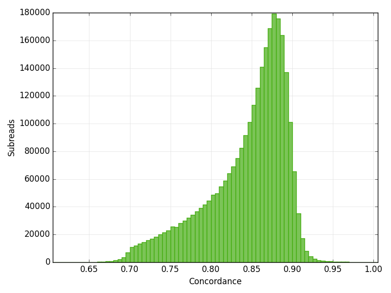
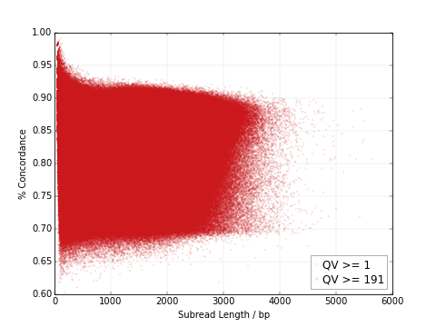

----------------------------
**Mapping Statistics Summary**
----------------------------

==================================== =================================== ===============================================
Column Name                          Attribute ID                        Description
==================================== =================================== ===============================================
Movie                                                                    Movie ID
Mapped Reads                         mapped_reads_n                      The number of polymerase reads mapped to the reference sequence
Mapped Polymerase Read Length        mapped_readlength_mean              The approximate mean length of polymerase reads that mapped to the reference sequence (including adapters and other unmapped regions)
Mapped Polymerase Read Length n50    mapped_readlength_n50               The read length at which 50% of the mapped bases are in polymerase reads longer than, or equal to, this value
Mapped Subreads                      mapped_subreads_n                   The number of subreads mapped to the reference sequence
Mapped Subread Bases                 mapped_subread_bases_n              The number of subread bases mapped to the reference sequence
Mapped Subread Length                mapped_subread_readlength_mean      The mean length of subreads that mapped to the reference sequence
Mapped Subread Concordance           mapped_subread_concordance_mean     The mean concordance of subreads that mapped to the reference sequence
==================================== =================================== ===============================================

---------------------------------
**Mapped Polymerase Read Length**
---------------------------------

**mapping_stats.readlength_plot.readlength_plot**

Histogram of Polymerase Read Length

.. image:: mapped_polymerase_readlength_histogram.png

------------------------------
**Mapped Subread Concordance**
------------------------------

**mapping_stats.subread_concordance_group.concordance_plot**

Description

-------------------------
**Mapped Subread Length**
-------------------------

**mapping_stats.subreadlength_plot.subreadlength_plot**

Histogram of Subread Length

.. image:: mapped_subreadlength_histogram.pn

----------------------------------------
**Mapped Concordance vs. Read Length**
----------------------------------------

**mapping_stats.rainbow_plot.rainbow_plot**

Description

