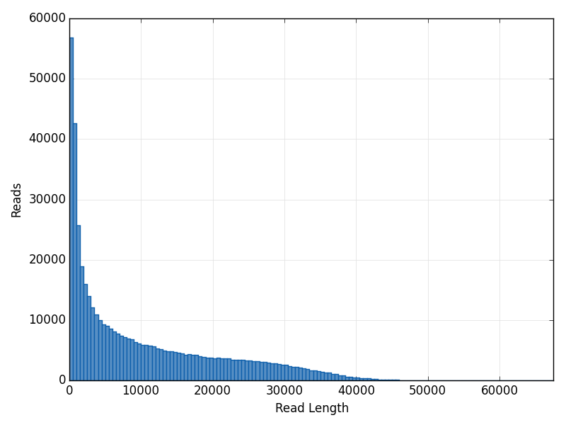
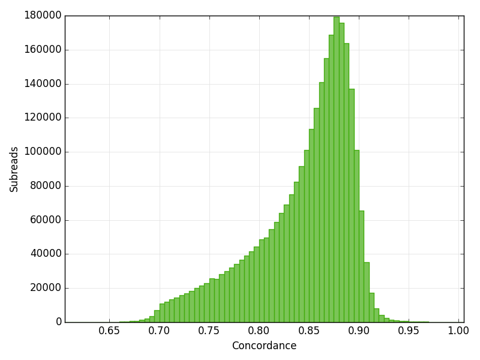
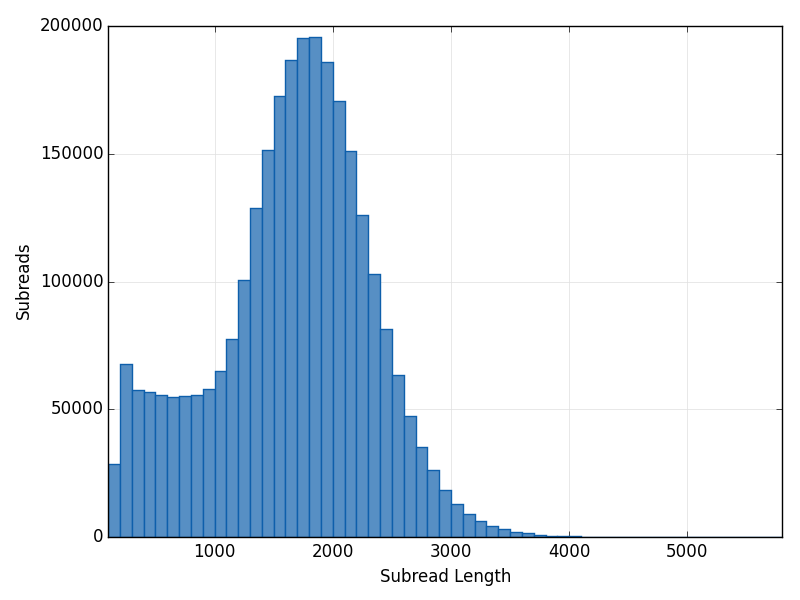
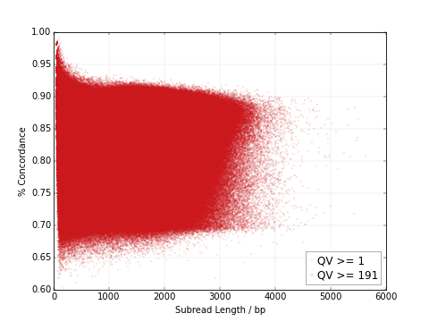

---------------------------------
**Mapping Statistics Attributes**
---------------------------------

===============================  ====================================  =====================================================================================================================================
Attribute ID                     Name                                  Description
===============================  ====================================  =====================================================================================================================================
mapped_subread_concordance_mean  Mean Mapped Concordance               The mean concordance of subreads that mapped to the reference sequence
mapped_subreads_n                Number of Subreads (mapped)           The number of subreads mapped to the reference sequence
mapped_subread_bases_n           Number of Subread Bases (mapped)      The number of subread bases mapped to the reference sequence
mapped_subread_readlength_mean   Subread Length Mean (mapped)          The mean length of the mapped portion of subreads which mapped to the reference sequence
mapped_subreadlength_n50         Subread Length N50 (mapped)           The subread length at which 50% of the mapped bases are in subreads longer than, or equal to, this value
mapped_subreadlength_q95         Subread Length 95% (mapped)           The 95th percentile of length of subreads that mapped to the reference sequence
mapped_subread_readlength_max    Subread Length Max (mapped)           The maximum length of subreads that mapped to the reference sequence
mapped_reads_n                   Number of Polymerase Reads (mapped)   The number of polymerase reads mapped to the reference sequence
mapped_readlength_mean           Polymerase Read Length Mean (mapped)  The approximate mean length of polymerase reads that mapped to the reference sequence (including adapters and other unmapped regions)
mapped_readlength_n50            Polymerase Read N50 (mapped)          The read length at which 50% of the mapped bases are in polymerase reads longer than, or equal to, this value
mapped_readlength_q95            Polymerase Read Length 95% (mapped)   The 95th percentile of read length of polymerase reads that mapped to the reference sequence
mapped_readlength_max            Polymerase Read Length Max (mapped)   The maximum length of polymerase reads that mapped to the reference sequence
===============================  ====================================  =====================================================================================================================================

----------------------------
**Table: Mapping Statistics Summary**
----------------------------

==================================== =================================== ===============================================
Column Name                          Attribute ID                        Description
==================================== =================================== ===============================================
Movie                                N/A                                 Movie ID
Mapped Reads                         mapped_reads_n                      The number of polymerase reads mapped to the reference sequence
Mapped Polymerase Read Length        mapped_readlength_mean              The approximate mean length of polymerase reads that mapped to the reference sequence (including adapters and other unmapped regions)
Mapped Polymerase Read Length n50    mapped_readlength_n50               The read length at which 50% of the mapped bases are in polymerase reads longer than, or equal to, this value
Mapped Subreads                      mapped_subreads_n                   The number of subreads mapped to the reference sequence
Mapped Subread Bases                 mapped_subread_bases_n              The number of subread bases mapped to the reference sequence
Mapped Subread Length                mapped_subread_readlength_mean      The mean length of subreads that mapped to the reference sequence
Mapped Subread Concordance           mapped_subread_concordance_mean     The mean concordance of subreads that mapped to the reference sequence
==================================== =================================== ===============================================

---------------------------------
**Mapped Polymerase Read Length**
---------------------------------

**mapping_stats.readlength_plot.readlength_plot**

Histogram of Polymerase Read Length.

------------------------------
**Mapped Subread Concordance**
------------------------------

**mapping_stats.subread_concordance_group.concordance_plot**

Histogram of Concordance among Mapped Subreads.

-------------------------
**Mapped Subread Length**
-------------------------

**mapping_stats.subreadlength_plot.subreadlength_plot**

Histogram of Mapped Subread Length.

----------------------------------------
**Mapped Concordance vs. Read Length**
----------------------------------------

**mapping_stats.rainbow_plot.rainbow_plot**

Concordance as a function of Read Length in base pairs. Each point on the graph represents the concordance and length of a single subread as measured by a local alignment to the reference.  The points are colored by MapQV, a measure of the significance of each alignment.

